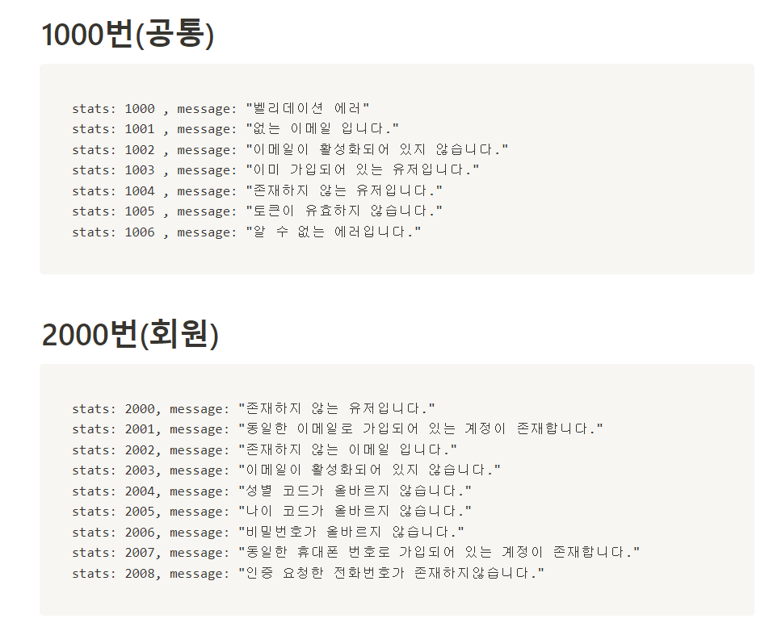
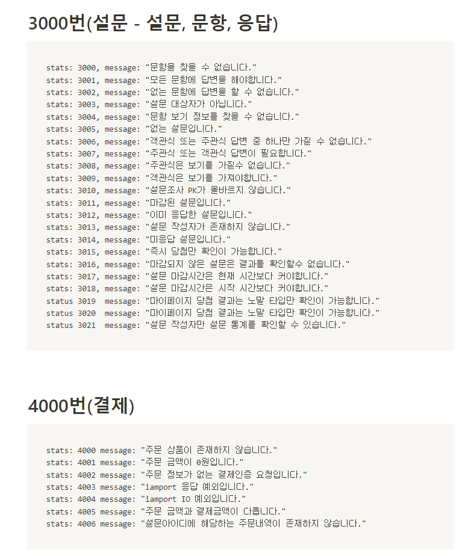

# Special Survey Service

# 프로젝트 소개

<aside>

> #### 개발 기간 : 2023.07 ~ 2023.08  
> 🔍 SSS는 설문조사 후 투명하고 공정하게 리워드를 지급받는 서비스입니다.
> 저희는 제작한 설문에 대해 랜덤 알고리즘을 이용하여 당첨자를 추출하도록 하였습니다. 그리고 실시간 로그를 이용하여 당첨자를 투명하게 공개함으로써 모두가 당첨자를 확인할 수 있도록 하였습니다.

 

 

</aside>

# 💻 Developer

| **박슬빈👑** | **최연재** | **권선근** |
|:---------:|:-------:|:-------:|
|  BackEnd  | BackEnd | BackEnd |

| **곽보선**  | **신종혁**  | **전대현**  |
|:--------:|:--------:|:--------:|
| FrontEnd | FrontEnd | FrontEnd |

 

## 사용 기술 스택

| Java(17.0.7) | SpringBoot(3.1.1) | SpringSecurity |
|:------------:|:-----------------:|:--------------:|
|   ![java]    |     ![Spring]     |  ![security]   |

### 테스팅 도구

|  Junit5  |
|:--------:|
| ![junit] |

### 데이터베이스

| MySql(8.0) |  redis   |
|:----------:|:--------:|
|  ![mysql]  | ![redis] |

### 배포

|  AWS   |  Docker   |  Jenkins   |
|:------:|:---------:|:----------:|
| ![aws] | ![docker] | ![jenkins] |

 

# ERD

![erd]

# 🎉기능 목록

  
본문확인

<h2>설문 작성자 기능</h2>
<li>설문 조사 작성, 시작, 마감</li>
<li>설문 조사 즉시 당첨, 마감 후 당첨 기능 선택</li>
<li>설문 조사 통계</li>

<h2>설문 응답자 기능</h2>
<li>본인확인을 위한 휴대폰 인증</li>
<li>응답 가능한 설문 추천 기능</li>
<li>설문 조사 응답</li>
<li>응답한 설문 당첨 확인 기능</li>
<li>설문 당첨자 목록 로그 확인 기능</li>

# 🧱 아키텍처

![architecture]

# 🛠 기술 선택 배경

## Redis

![redis_img]
 
설문에 당첨 상품이 있다는 조건 때문에 본인 인증을 통해 1인 1계정만 가입할 수 있도록 하는것이 중요했습니다. 
그래서 본인인증은 휴대폰 인증코드를 통해 하였고 인증코드의 5분의 유효기간과 단발성 데이터라는 특성 때문에
RDBMS에 저장하는 것은 적합하지 않다고 판단해 TTL을 지원해주고 데이터 접근이 빠른 Redis를 사용했습니다.

## Quartz

![quartz]
 
설문 시작 마감 이라는 상태를 동적으로 변경을 하는 스케줄링 작업이 필요했습니다. 동적으로 변한다는 특징 때문에 @Scheduled 어노테이션으로는 부족하다고 생각하여
Quartz 라이브러리를 사용하게 되었습니다.

 

# ⚙ 테스트 코드, 커스텀 에러 코드

![testcode]
 

 

- 프로젝트의 목표는 실 사용자를 받자였습니다.
- 안정적인 서비스를 제공하기 위해 최대한 많은 커스텀 에러 코드와 테스트 코드를 작성하기 위해 노력했습니다.
- 그 결과 223개의 테스트 코드를 작성, jacoco 라인 커버리지 100% 달성, 약 60개 커스텀 에러 코드를 만들었습니다.

<!-- Stack Icon Refernces -->

[java]: /images/java-color.svg

[junit]: /images/junit5-color.svg

[mysql]: /images/mysql-color.svg

[redis]: /images/redis-color.svg

[spring]: /images/springboot-color.svg

[security]: /images/springsecurity-color.svg

[docker]: /images/docker-color.svg

[jenkins]: /images/jenkins-color.svg

[aws]: /images/amazonaws-color.svg

[erd]: /images/erd.PNG

[architecture]: /images/architecture.png

[redis_img]: /images/redis_image.png

[quartz]: /images/quartz.jpg

[testcode]: /images/testcode.PNG

[error1]: /images/error1.PNG

[error2]: /images/error2.PNG

